<h1 align="center">📱 Công Nghệ Lập Trình Web - Đồ Án Web Bán Điện Thoại</h1>

  <i>Đồ án môn Web 1 (Web tĩnh) - Đề tài xây dựng trang web bán điện thoại với giao diện thân thiện, dễ sử dụng và đầy đủ chức năng.</i>
    
  

---

## ✨ Tính năng nổi bật

### 🛒 Chức năng Cơ bản (Người dùng)
*   **Trang chủ thu hút:** Hiển thị sản phẩm theo nhiều tiêu chí (Nổi bật, Mới, Khuyến mãi, Giá rẻ...).
*   **Tìm kiếm & Lọc thông minh:** Hỗ trợ lọc/sắp xếp theo hãng, mức giá, tên, khuyến mãi, số sao đánh giá...
*   **Quản lý tài khoản & Mua sắm:** Đăng ký, đăng nhập, quản lý giỏ hàng, trang hồ sơ người dùng và lịch sử mua hàng.
*   **Chi tiết sản phẩm:** Giao diện trực quan, tích hợp tính năng **gợi ý sản phẩm** tương tự.

### ⚙️ Chức năng Admin (Quản trị viên)
*   📊 **Thống kê:** Báo cáo số lượng bán ra và doanh thu chi tiết của từng hãng.
*   📦 **Quản lý Sản phẩm:** Xem danh sách, tìm kiếm, lọc, thêm, sửa, xoá sản phẩm.
*   📝 **Quản lý Đơn hàng:** Theo dõi danh sách, tìm kiếm, duyệt hoặc huỷ đơn hàng.
*   👥 **Quản lý Khách hàng:** Xem danh sách, thêm, xoá hoặc khoá tài khoản khách hàng.

> **🔐 Tài khoản Admin mặc định:**
> *   **Username:** `admin`
> *   **Password:** `adadad`

---

## 📸 Hình ảnh Demo (Screenshots)

### 👤 Giao diện Người dùng (Client)

| Trang chủ | Sản phẩm nổi bật |
| :---: | :---: |
| 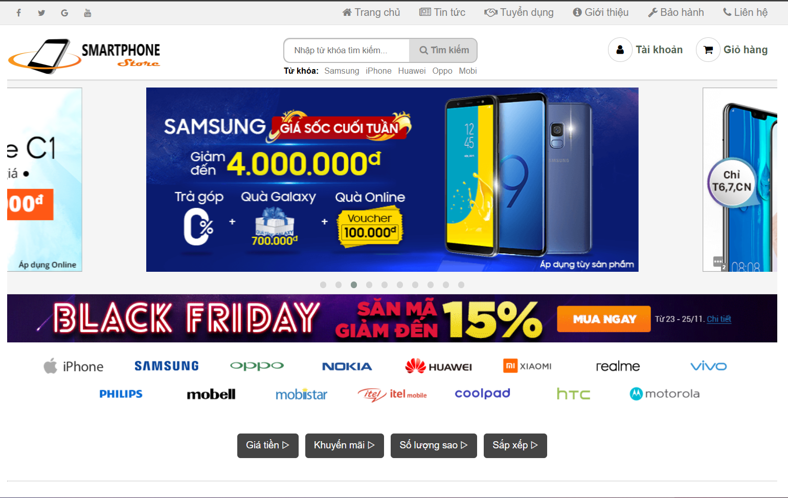 | 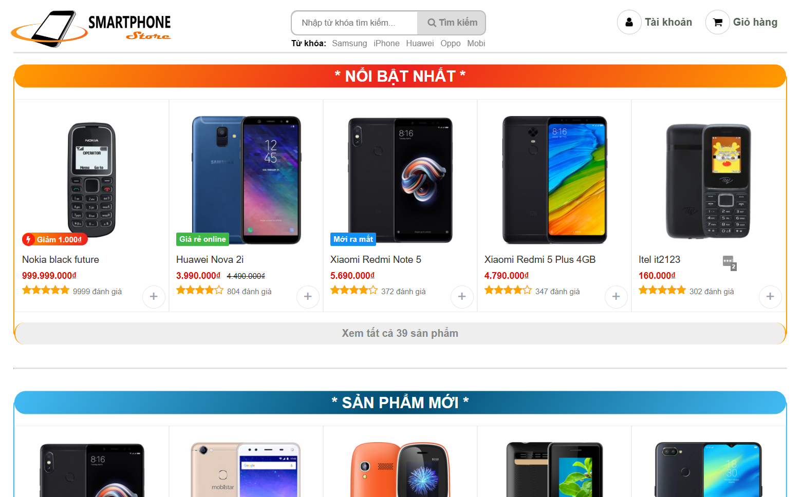 |
| **Chi tiết sản phẩm** | **Tìm kiếm / Lọc / Sắp xếp** |
| 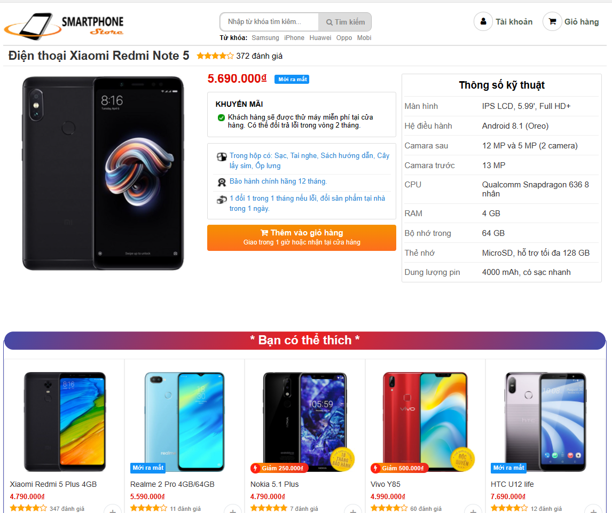 | 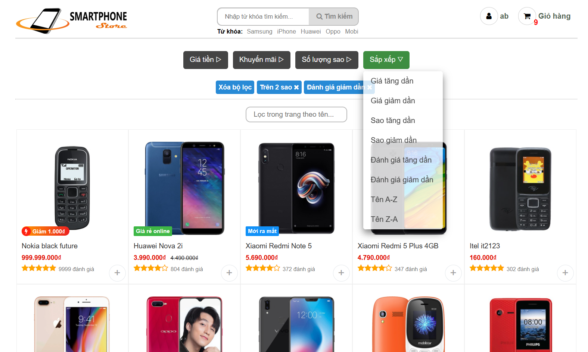 |
| **Đăng nhập** | **Đăng ký** |
| 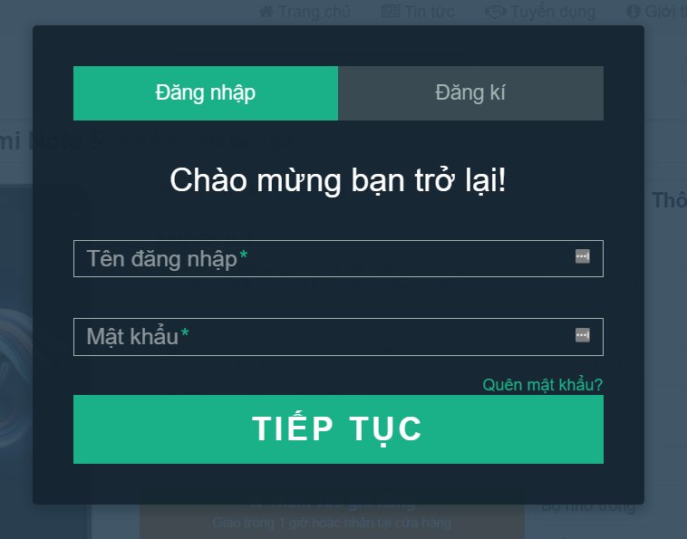 | 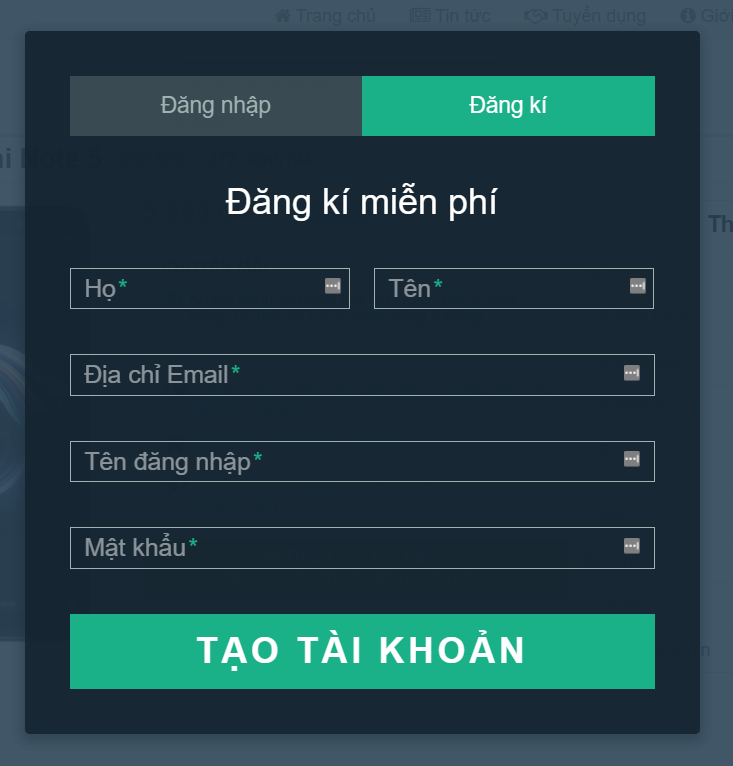 |
| **Trang người dùng** | **Giỏ hàng** |
| 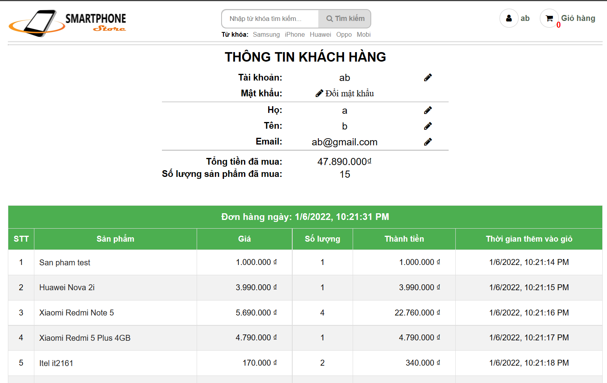 | 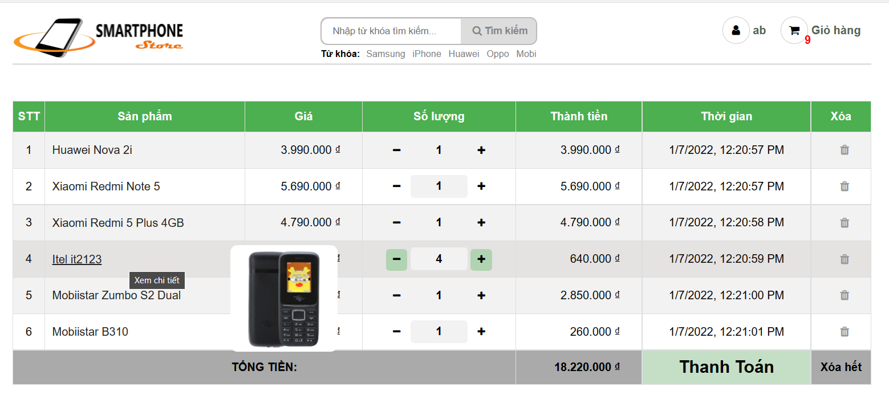 |

### 🛡️ Giao diện Quản trị (Admin)

| Thống kê | Quản lý Sản phẩm |
| :---: | :---: |
| 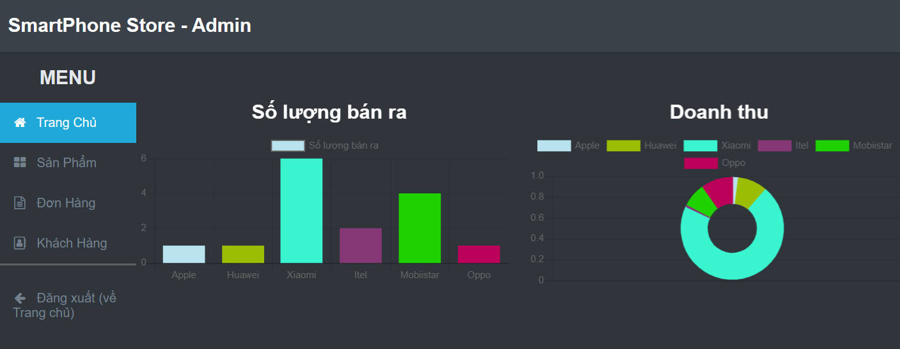 | 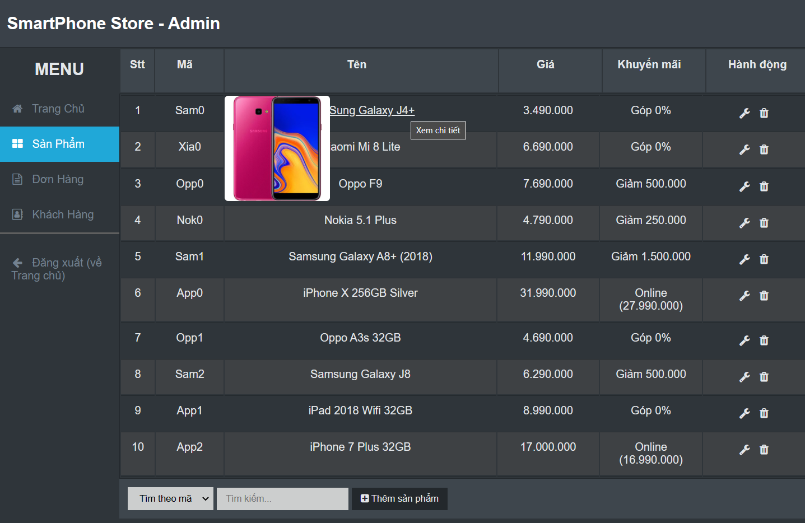 |
| **Quản lý Đơn hàng** | **Quản lý Người dùng** |
| 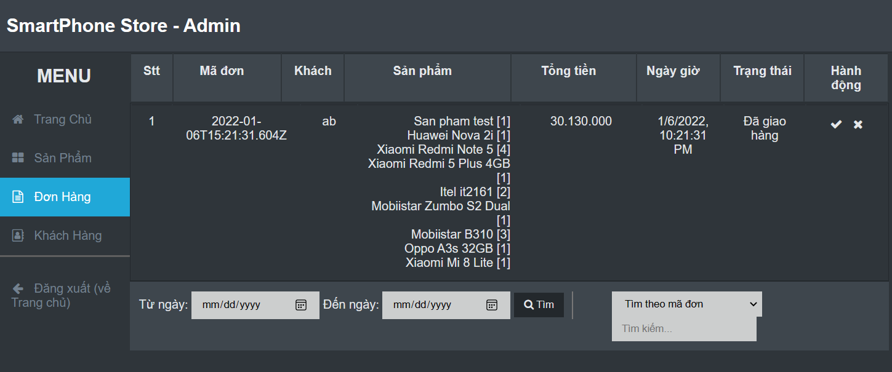 | 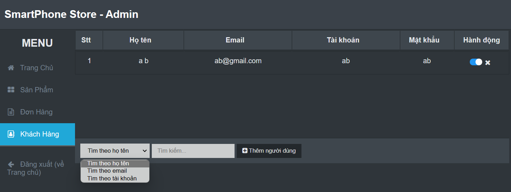 |

---

  <b>Nếu bạn thấy dự án này hữu ích, đừng quên cho mình 1 ⭐ nhé! Cảm ơn bạn rất nhiều.</b>

